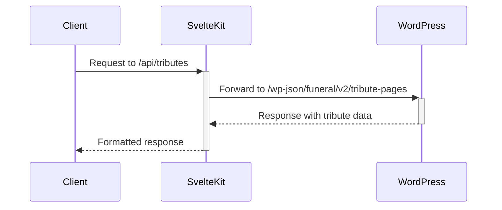

# API Tributes Implementation Plan

## Problem

The application is encountering a "SvelteKitError: Not found: /api/tributes" error because it's trying to access an API endpoint that doesn't exist. The WordPress API endpoints for tributes are registered under the namespace `funeral/v2/tribute-pages`, but the SvelteKit application is looking for them at `/api/tributes`.

## Analysis

### Missing API Endpoints

The application expects the following endpoints to exist:
- `/api/tributes` - For listing and creating tributes
- `/api/tributes/[id]` - For getting, updating, and deleting a specific tribute
- `/api/tributes/by-slug/[slug]` - For getting a tribute by slug

### Existing Code Dependencies

- `TributeModel` in `wp-backbone.ts` has `urlRoot: '/api/tributes'`
- `tributeService` in `wp-backbone-service.ts` makes direct fetch calls to `/api/tributes`
- `TributeStore` in `tribute-store.svelte.ts` also makes fetch calls to `/api/tributes`

### WordPress API Structure

- The WordPress plugin registers tribute endpoints under `funeral/v2/tribute-pages`
- Authentication is handled via JWT tokens stored in cookies

## Solution

Create proxy endpoints in SvelteKit that will forward requests from `/api/tributes` to the WordPress API endpoints at `funeral/v2/tribute-pages`. This approach is similar to how the authentication endpoints are implemented in the application.



## Implementation Steps

### 1. Create Base API Endpoint Files

- Create `/src/routes/api/tributes/+server.ts` for GET (list) and POST (create) operations
- Create `/src/routes/api/tributes/[id]/+server.ts` for GET, PUT, and DELETE operations on a specific tribute
- Create `/src/routes/api/tributes/by-slug/[slug]/+server.ts` for getting a tribute by slug

### 2. Implement Request Forwarding Logic

- Use the JWT token from cookies for authentication
- Forward requests to the appropriate WordPress API endpoints
- Handle errors and format responses consistently

### 3. Test the Implementation

- Verify that the dashboard tributes page loads without errors
- Test CRUD operations to ensure they work as expected

## Detailed Implementation

### 1. Create `/src/routes/api/tributes/+server.ts`

This endpoint will handle:
- GET requests to list tributes (with optional filtering, pagination)
- POST requests to create new tributes

```typescript
// src/routes/api/tributes/+server.ts
import { json } from '@sveltejs/kit';
import type { RequestHandler } from './$types';
import { getTokenFromCookie } from '$lib/utils/cookie-auth';

// Base WordPress API URL
const WP_API_BASE = 'https://wp.tributestream.com/wp-json/funeral/v2';

export const GET: RequestHandler = async ({ request, cookies, url }) => {
    console.log('🚀 [Tributes API] GET request received.');
    
    // Get token from cookies
    const token = getTokenFromCookie(cookies);
    
    // Forward query parameters
    const queryParams = new URLSearchParams();
    for (const [key, value] of url.searchParams) {
        queryParams.append(key, value);
    }
    
    // Build the WordPress API URL
    const wpApiUrl = `${WP_API_BASE}/tribute-pages${queryParams.toString() ? '?' + queryParams.toString() : ''}`;
    
    try {
        // Make request to WordPress API
        const response = await fetch(wpApiUrl, {
            headers: token ? {
                'Authorization': `Bearer ${token}`
            } : {}
        });
        
        // Get response data
        const data = await response.json();
        
        // Handle error responses
        if (!response.ok) {
            console.error('❌ [Tributes API] WordPress returned an error:', data);
            return json({ message: data.message || 'Failed to fetch tributes' }, { status: response.status });
        }
        
        // Return success response
        return json({
            success: true,
            tributes: data.data?.tributes || [],
            total_pages: data.data?.total_pages || 1,
            current_page: data.data?.current_page || 1
        });
    } catch (error) {
        console.error('🚨 [Tributes API] Error occurred while fetching tributes:', error);
        return json({ message: 'Internal server error' }, { status: 500 });
    }
};

export const POST: RequestHandler = async ({ request, cookies }) => {
    console.log('🚀 [Tributes API] POST request received.');
    
    // Get token from cookies
    const token = getTokenFromCookie(cookies);
    
    // Check if user is authenticated
    if (!token) {
        return json({ message: 'Authentication required' }, { status: 401 });
    }
    
    try {
        // Parse request body
        const requestBody = await request.json();
        
        // Make request to WordPress API
        const response = await fetch(`${WP_API_BASE}/tribute-pages`, {
            method: 'POST',
            headers: {
                'Content-Type': 'application/json',
                'Authorization': `Bearer ${token}`
            },
            body: JSON.stringify(requestBody)
        });
        
        // Get response data
        const data = await response.json();
        
        // Handle error responses
        if (!response.ok) {
            console.error('❌ [Tributes API] WordPress returned an error:', data);
            return json({ message: data.message || 'Failed to create tribute' }, { status: response.status });
        }
        
        // Return success response
        return json({
            success: true,
            tribute_id: data.data?.tribute_id,
            slugified_name: data.data?.slugified_name
        });
    } catch (error) {
        console.error('🚨 [Tributes API] Error occurred while creating tribute:', error);
        return json({ message: 'Internal server error' }, { status: 500 });
    }
};
```

### 2. Create `/src/routes/api/tributes/[id]/+server.ts`

This endpoint will handle:
- GET requests to fetch a specific tribute
- PUT requests to update a tribute
- DELETE requests to delete a tribute

```typescript
// src/routes/api/tributes/[id]/+server.ts
import { json } from '@sveltejs/kit';
import type { RequestHandler } from './$types';
import { getTokenFromCookie } from '$lib/utils/cookie-auth';

// Base WordPress API URL
const WP_API_BASE = 'https://wp.tributestream.com/wp-json/funeral/v2';

export const GET: RequestHandler = async ({ params, cookies }) => {
    console.log(`🚀 [Tributes API] GET request received for tribute ID: ${params.id}`);
    
    // Get token from cookies
    const token = getTokenFromCookie(cookies);
    
    try {
        // Make request to WordPress API
        const response = await fetch(`${WP_API_BASE}/tribute-pages/${params.id}`, {
            headers: token ? {
                'Authorization': `Bearer ${token}`
            } : {}
        });
        
        // Get response data
        const data = await response.json();
        
        // Handle error responses
        if (!response.ok) {
            console.error('❌ [Tributes API] WordPress returned an error:', data);
            return json({ message: data.message || 'Failed to fetch tribute' }, { status: response.status });
        }
        
        // Return success response
        return json({
            success: true,
            ...data.data
        });
    } catch (error) {
        console.error('🚨 [Tributes API] Error occurred while fetching tribute:', error);
        return json({ message: 'Internal server error' }, { status: 500 });
    }
};

export const PUT: RequestHandler = async ({ params, request, cookies }) => {
    console.log(`🚀 [Tributes API] PUT request received for tribute ID: ${params.id}`);
    
    // Get token from cookies
    const token = getTokenFromCookie(cookies);
    
    // Check if user is authenticated
    if (!token) {
        return json({ message: 'Authentication required' }, { status: 401 });
    }
    
    try {
        // Parse request body
        const requestBody = await request.json();
        
        // Make request to WordPress API
        const response = await fetch(`${WP_API_BASE}/tribute-pages/${params.id}`, {
            method: 'PUT',
            headers: {
                'Content-Type': 'application/json',
                'Authorization': `Bearer ${token}`
            },
            body: JSON.stringify(requestBody)
        });
        
        // Get response data
        const data = await response.json();
        
        // Handle error responses
        if (!response.ok) {
            console.error('❌ [Tributes API] WordPress returned an error:', data);
            return json({ message: data.message || 'Failed to update tribute' }, { status: response.status });
        }
        
        // Return success response
        return json({
            success: true,
            tribute_id: data.data?.tribute_id,
            slugified_name: data.data?.slugified_name
        });
    } catch (error) {
        console.error('🚨 [Tributes API] Error occurred while updating tribute:', error);
        return json({ message: 'Internal server error' }, { status: 500 });
    }
};

export const DELETE: RequestHandler = async ({ params, cookies }) => {
    console.log(`🚀 [Tributes API] DELETE request received for tribute ID: ${params.id}`);
    
    // Get token from cookies
    const token = getTokenFromCookie(cookies);
    
    // Check if user is authenticated
    if (!token) {
        return json({ message: 'Authentication required' }, { status: 401 });
    }
    
    try {
        // Make request to WordPress API
        const response = await fetch(`${WP_API_BASE}/tribute-pages/${params.id}`, {
            method: 'DELETE',
            headers: {
                'Authorization': `Bearer ${token}`
            }
        });
        
        // Get response data
        const data = await response.json();
        
        // Handle error responses
        if (!response.ok) {
            console.error('❌ [Tributes API] WordPress returned an error:', data);
            return json({ message: data.message || 'Failed to delete tribute' }, { status: response.status });
        }
        
        // Return success response
        return json({
            success: true,
            deleted_id: params.id
        });
    } catch (error) {
        console.error('🚨 [Tributes API] Error occurred while deleting tribute:', error);
        return json({ message: 'Internal server error' }, { status: 500 });
    }
};
```

### 3. Create `/src/routes/api/tributes/by-slug/[slug]/+server.ts`

This endpoint will handle:
- GET requests to fetch a tribute by slug

```typescript
// src/routes/api/tributes/by-slug/[slug]/+server.ts
import { json } from '@sveltejs/kit';
import type { RequestHandler } from './$types';
import { getTokenFromCookie } from '$lib/utils/cookie-auth';

// Base WordPress API URL
const WP_API_BASE = 'https://wp.tributestream.com/wp-json/funeral/v2';

export const GET: RequestHandler = async ({ params, cookies }) => {
    console.log(`🚀 [Tributes API] GET request received for tribute slug: ${params.slug}`);
    
    // Get token from cookies
    const token = getTokenFromCookie(cookies);
    
    try {
        // Make request to WordPress API
        const response = await fetch(`${WP_API_BASE}/tribute-pages/by-slug/${params.slug}`, {
            headers: token ? {
                'Authorization': `Bearer ${token}`
            } : {}
        });
        
        // Get response data
        const data = await response.json();
        
        // Handle error responses
        if (!response.ok) {
            console.error('❌ [Tributes API] WordPress returned an error:', data);
            return json({ message: data.message || 'Failed to fetch tribute by slug' }, { status: response.status });
        }
        
        // Return success response
        return json({
            success: true,
            tribute: data.data
        });
    } catch (error) {
        console.error('🚨 [Tributes API] Error occurred while fetching tribute by slug:', error);
        return json({ message: 'Internal server error' }, { status: 500 });
    }
};
```

## Testing Plan

After implementing the proxy endpoints, we should test them to ensure they work correctly:

1. **Manual Testing**:
   - Load the dashboard tributes page to verify it can fetch tributes
   - Create a new tribute and verify it appears in the list
   - Edit an existing tribute and verify the changes are saved
   - Delete a tribute and verify it's removed from the list

2. **Error Handling**:
   - Test with invalid data to ensure error messages are displayed correctly
   - Test without authentication to ensure protected endpoints require authentication