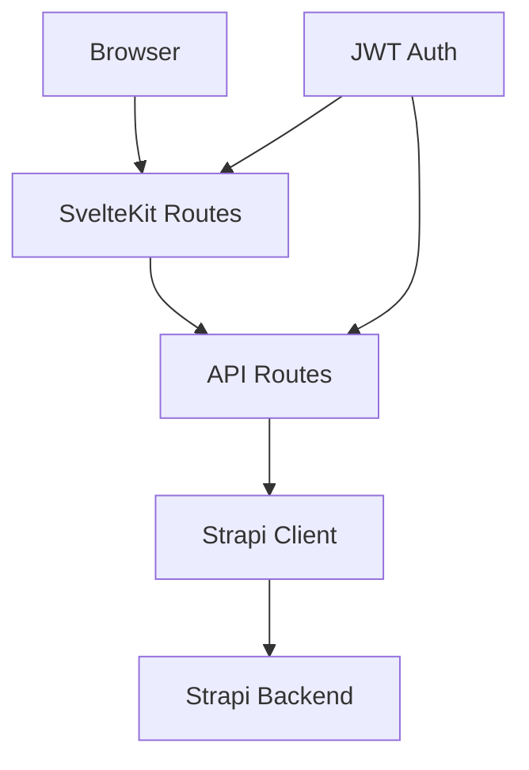

# SvelteKit + Strapi Client Architecture

This document explains the architecture and implementation of the SvelteKit + Strapi Client proxy pattern used in this project.

## Overview

The architecture follows a clean, scalable approach for interacting with a Strapi backend from a SvelteKit frontend:



Frontend components never directly communicate with Strapi. Instead, all requests are proxied through our own API routes, ensuring:

- Consistent security practices
- Proper error handling
- Backend implementation details remain isolated
- Role-based access enforcement happens in our code

## Directory Structure

```
frontend/
├── .env                         # API URL and token configuration
├── src/
│   ├── lib/
│   │   ├── server/
│   │   │   ├── strapi/
│   │   │   │   ├── client.ts    # Base Strapi client configuration
│   │   │   │   ├── tribute.ts   # Tribute-specific Strapi operations
│   │   │   │   ├── user.ts      # User-specific Strapi operations
│   │   │   ├── utils/
│   │   │   │   ├── auth.ts      # JWT validation utilities
│   │   │   │   ├── logger.ts    # Centralized logging functionality
│   ├── routes/
│   │   ├── api/
│   │   │   ├── tribute/
│   │   │   │   ├── +server.ts           # Tribute collection actions
│   │   │   │   ├── [id]/+server.ts      # Single tribute actions
│   │   │   ├── user/
│   │   │   │   ├── +server.ts           # Current user actions
│   │   │   │   ├── [id]/+server.ts      # Admin user actions
│   ├── hooks.server.ts          # Auth check, session population
```

## Detailed Component Breakdown

### 1. Environment Configuration

**File:** `frontend/.env`

Contains the essential configuration for connecting to the Strapi backend:

```env
STRAPI_API_URL=
STRAPI_API_TOKEN=
```

These values must be set to your Strapi instance URL and a valid API token with appropriate permissions.

### 2. Strapi Client Module

**File:** `src/lib/server/strapi/client.ts`

Creates and exports a configured Strapi client instance using environment variables:

```typescript
import { createClient } from '@strapi/strapi';
import { env } from '@svelte/kit';
export const strapi = createClient({
    url: env.STRAPI_API_URL!,
    token: env.STRAPI_API_TOKEN
});
```

This client is used by other modules to interact with the Strapi API.

### 3. Collection-Specific Wrapper Modules

#### 3.1 Tribute Operations

**File:** `src/lib/server/strapi/tribute.ts`

Provides wrapper functions for Tribute-related Strapi operations:

```typescript
import { strapi } from './client';

export async function createTribute(data: any) {
    return await strapi.create('tributes', { data });
}

export async function getTributeById(id: string) {
    return await strapi.findOne('tributes', id);
}

export async function updateTribute(id: string, data: any) {
    return await strapi.update('tributes', id, { data });
}

export async function deleteTribute(id: string) {
    return await strapi.delete('tributes', id);
}
```

#### 3.2 User Operations

**File:** `src/lib/server/strapi/user.ts`

Provides wrapper functions for User-related Strapi operations:

```typescript
import { strapi } from './client';

export async function createUser(data: any) {
    return await strapi.create('users', { data });
}

export async function getUserById(id: string) {
    return await strapi.findOne('users', id);
}

export async function updateUser(id: string, data: any) {
    return await strapi.update('users', id, { data });
}

export async function deleteUser(id: string) {
    return await strapi.delete('users', id);
}
```

### 4. Utility Modules

#### 4.1 Authentication Utilities

**File:** `src/lib/server/utils/auth.ts`

Re-exports JWT validation functionality:

```typescript
import { getUserFromJwt as _getUserFromJwt } from '$lib/server/auth/jwt';

export async function getUserFromJwt(token: string) {
  return _getUserFromJwt(token);
}
```

#### 4.2 Logging Utilities

**File:** `src/lib/server/utils/logger.ts`

Provides consistent logging throughout the application:

```typescript
export function info(...args: unknown[]) {
  console.log('[info]', ...args);
}

export function warn(...args: unknown[]) {
  console.warn('[warn]', ...args);
}

export function error(...args: unknown[]) {
  console.error('[error]', ...args);
}
```

### 5. API Routes

#### 5.1 Tribute API Routes

**File:** `src/routes/api/tribute/+server.ts`

Handles collection-level tribute operations:

```typescript
import { json } from '@sveltejs/kit';
import { createTribute } from '$lib/server/strapi/tribute';

export async function POST({ request }) {
    const data = await request.json();
    const tribute = await createTribute(data);
    return json(tribute);
}
```

**File:** `src/routes/api/tribute/[id]/+server.ts`

Handles individual tribute operations:

```typescript
import { json, error } from '@sveltejs/kit';
import { getTributeById, updateTribute, deleteTribute } from '$lib/server/strapi/tribute';

export async function GET({ params }) {
    const tribute = await getTributeById(params.id);
    if (!tribute) throw error(404, 'Not found');
    return json(tribute);
}

export async function PUT({ request, params }) {
    const data = await request.json();
    const updated = await updateTribute(params.id, data);
    return json(updated);
}

export async function DELETE({ params }) {
    await deleteTribute(params.id);
    return new Response(null, { status: 204 });
}
```

#### 5.2 User API Routes

**File:** `src/routes/api/user/+server.ts`

Handles current user operations:

```typescript
import { json, error } from '@sveltejs/kit';
import { getUserById, updateUser } from '$lib/server/strapi/user';

export async function GET({ locals }) {
    const user = locals.user;
    if (!user) throw error(401, 'Unauthorized');
    
    const userData = await getUserById(user.id);
    return json(userData);
}

export async function PUT({ request, locals }) {
    const data = await request.json();
    const user = locals.user;
    if (!user) throw error(401, 'Unauthorized');
    
    const updated = await updateUser(user.id, data);
    return json(updated);
}
```

**File:** `src/routes/api/user/[id]/+server.ts`

Handles admin user operations:

```typescript
import { json, error } from '@sveltejs/kit';
import { getUserById, updateUser, deleteUser } from '$lib/server/strapi/user';

export async function GET({ params }) {
    const user = await getUserById(params.id);
    if (!user) throw error(404, 'Not found');
    return json(user);
}

export async function PUT({ request, params }) {
    const data = await request.json();
    const updated = await updateUser(params.id, data);
    return json(updated);
}

export async function DELETE({ params }) {
    await deleteUser(params.id);
    return new Response(null, { status: 204 });
}
```

### 6. Authentication Hook

**File:** `src/hooks.server.ts`

Sets up authentication for all routes:

```typescript
import type { Handle } from '@sveltejs/kit';
import { getUserFromJwt } from '$lib/server/utils/auth';

export const handle: Handle = async ({ event, resolve }) => {
    const token = event.cookies.get('jwt');
    if (token) {
        event.locals.user = await getUserFromJwt(token); // optional
    }
    return resolve(event);
};
```

## Workflow & Data Flow

1. Upon receiving a request, `hooks.server.ts` extracts JWT from cookies and populates `locals.user`.
2. Route handlers access `locals.user` to perform auth checks and identify the current user.
3. API route handlers use Strapi client wrapper functions to interact with Strapi.
4. Data is properly transformed, error-handled, and returned to the frontend.

The resulting flow:
```
Browser → SvelteKit API route → Strapi Client → Strapi Server
```

## Security Considerations

- JWT tokens are stored in HTTP-only cookies, not localStorage
- Authentication is handled by SvelteKit middleware, not by the frontend
- API tokens are kept server-side only
- Direct Strapi access is not exposed to the browser

## Benefits of This Architecture

1. **Security**: The browser never directly accesses Strapi
2. **Encapsulation**: API implementation details are hidden from frontend
3. **Role Enforcement**: Permission checks happen in our code, not relying on Strapi alone
4. **Flexibility**: Can easily change backends without affecting the frontend
5. **Maintainability**: Clean separation of concerns