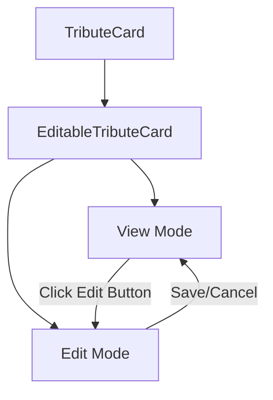
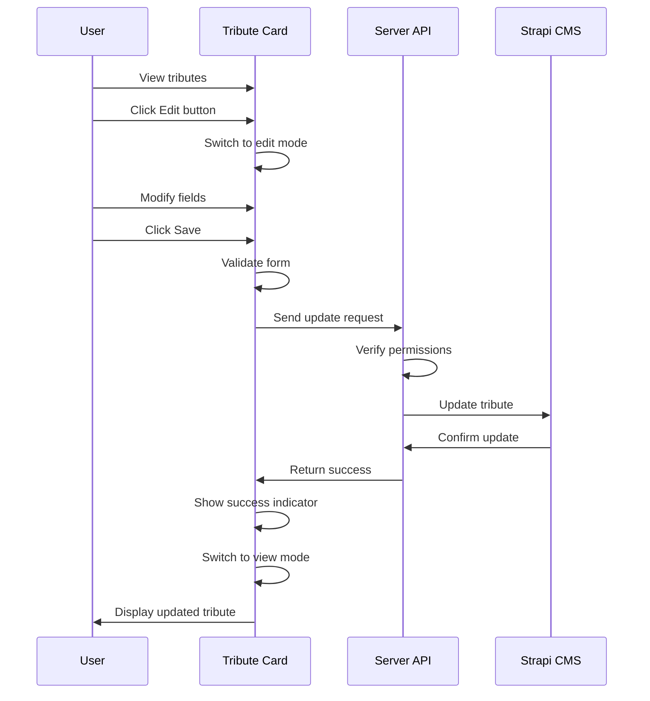

# Inline Edit Feature for Tributes - Implementation Plan

Based on your requirements, I'll outline a detailed plan for implementing an inline edit feature for tribute entries on the portal page.

## Requirements Summary

1. **Editable Fields**: Users should be able to edit name and description fields only  
2. **Permissions**:  
   - Users can edit their own tributes, regardless of role  
   - Admins can edit all tributes  
3. **Availability**: Edit functionality should be available on all portal views with appropriate permissions  

## Implementation Plan

### 1. Create an Editable Tribute Card Component



We'll create a new component that extends the current TributeCard with editing capabilities:

- **src/lib/components/tributes/editable-tribute-card.svelte**
  - Will have view/edit modes
  - Toggle between modes with an edit button
  - Form validation for editable fields
  - API integration for saving changes
  - Smooth transitions between states
  - Validation and user feedback

### 2. Create Server Endpoint for Tribute Updates

We need a properly secured API endpoint to handle tribute updates:

- **src/routes/api/tributes/[id]/+server.ts**
  - Implement PUT method for updates
  - Validate permissions (user ownership or admin role)
  - Validate input data
  - Return appropriate success/error responses

### 3. Update Tribute Grid Component

Modify the existing tribute grid to use our new editable card:

- **src/lib/components/tributes/tribute-grid.svelte**
  - Update to use EditableTributeCard instead of TributeCard
  - Pass user data to enable permission checks

### 4. Permission Utility Function

Create a utility to determine if a user can edit a specific tribute:

- **src/lib/utils/tribute-permissions.ts**
  - Logic to check if user is admin or tribute owner
  - Return boolean indicating edit permission

### 5. Add Status Management and User Feedback

Implement visual cues for different states:

- Loading indicator when saving
- Success message after saving
- Error feedback for validation failures
- Transition animations between states

## Technical Details

### EditableTributeCard Component Structure

```svelte
<script lang="ts">
  let isEditing = $state(false);
  let isSubmitting = $state(false);
  let formData = $state({ name: tribute.name, description: tribute.description });
  let validationErrors = $state({ name: '', description: '' });
  
  // Toggle edit mode
  function toggleEditMode() {...}
  
  // Validate form fields
  function validateForm() {...}
  
  // Save changes via API
  async function saveChanges() {...}
  
  // Cancel editing and reset form
  function cancelEdit() {...}
</script>

<!-- View mode -->
{#if !isEditing}
  <!-- Display card with edit button -->
{:else}
  <!-- Edit form with save/cancel buttons -->
{/if}
```

### API Implementation

```typescript
// src/routes/api/tributes/[id]/+server.ts
export async function PUT({ request, params, locals }) {
  // Check authentication
  const user = locals.user;
  if (!user) {
    return new Response(JSON.stringify({ error: 'Unauthorized' }), { status: 401 });
  }
  
  // Get tribute ID from params
  const id = params.id;
  
  // Get and validate request body
  const data = await request.json();
  
  // Check permissions (admin or tribute owner)
  const tribute = await getTributeById(id, event);
  const canEdit = user.role?.type === 'admin' || tribute.attributes.owner?.data?.id === user.id;
  
  if (!canEdit) {
    return new Response(JSON.stringify({ error: 'Forbidden' }), { status: 403 });
  }
  
  // Update tribute
  try {
    const updatedTribute = await updateTribute(id, data, event);
    return new Response(JSON.stringify(updatedTribute), { status: 200 });
  } catch (error) {
    return new Response(JSON.stringify({ error: error.message }), { status: 500 });
  }
}
```

## User Experience Flow



## Implementation Sequence

1. Create permission utility  
2. Implement server API endpoint  
3. Create EditableTributeCard component  
4. Update tribute grid to use new component  
5. Test with different user roles  
6. Add polish (animations, feedback)