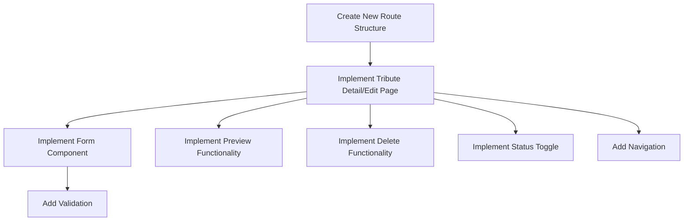
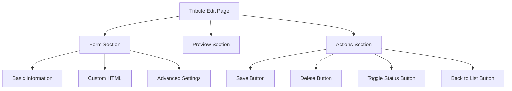
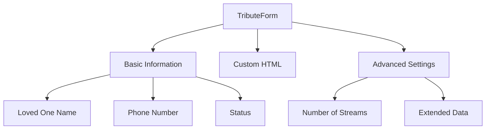
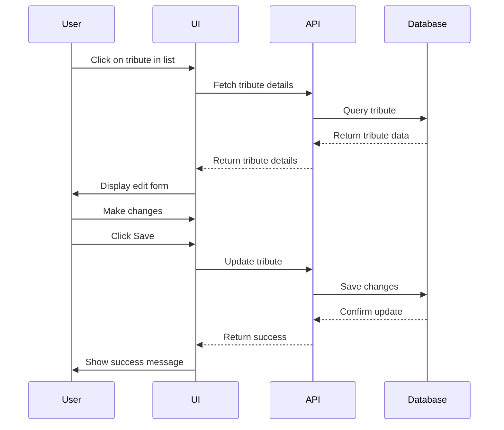

# Tribute Management Admin Interface - Implementation Plan

## Current State Analysis

The Tribute model has the following properties:
- From WPEntity: id, date, modified, slug, status, link
- Specific to Tribute: user_id, loved_one_name, phone_number, custom_html, number_of_streams, extended_data

The existing implementation has:
- A tribute list view at `/dashboard/tributes`
- A detail view at `/dashboard/tributes/[id]`
- An edit view at `/dashboard/tributes/[id]/edit`

## Implementation Plan



### 1. Create New Route Structure

Create a new route at `/tributes/{tributeId}` that will serve as the dedicated edit page for tributes.

```mermaid
graph LR
    A[/tributes] --> B[/{tributeId}]
    B --> C[+page.svelte]
    B --> D[+page.server.ts]
```

### 2. Implement Tribute Detail/Edit Page

The page will include:
- A form for editing tribute properties
- A preview section to see how the tribute will appear to users
- Actions for saving, deleting, and toggling visibility



### 3. Implement Form Component

Create a form component that includes all the properties from the Tribute model:



### 4. Add Validation

Implement validation for the form fields:
- Required fields: loved_one_name, phone_number
- Format validation for phone_number
- Status validation (must be one of: draft, pending, published)

### 5. Implement Preview Functionality

Add a preview section that shows how the tribute will appear to users:
- Display the tribute's custom HTML
- Show the tribute's basic information
- Update in real-time as changes are made

### 6. Implement Delete Functionality

Add a delete button with confirmation dialog:
- Show a confirmation dialog before deleting
- Redirect to the tributes list after successful deletion
- Display error messages if deletion fails

### 7. Implement Status Toggle

Add a toggle for changing the tribute's publication status:
- Allow changing between draft, pending, and published
- Update the status in real-time
- Display appropriate visual indicators for each status

### 8. Add Navigation

Add clear navigation options:
- Back button to return to the tributes list
- Breadcrumbs for easy navigation
- Links to related pages (e.g., public view)

## Technical Implementation Details

### File Structure

```
src/
└── routes/
    └── tributes/
        ├── +page.svelte (List view)
        ├── +page.server.ts (Data loading for list)
        └── [id]/
            ├── +page.svelte (Edit view)
            └── +page.server.ts (Data loading and actions)
```

### Component Structure

```
TributeEditPage
├── TributeForm
│   ├── BasicInfoSection
│   ├── CustomHtmlSection
│   └── AdvancedSettingsSection
├── TributePreview
└── TributeActions
```

### Data Flow



## Implementation Steps

1. **Create the route structure**:
   - Create `/src/routes/tributes/[id]/+page.svelte`
   - Create `/src/routes/tributes/[id]/+page.server.ts`

2. **Implement the server-side load function**:
   - Fetch the tribute data by ID
   - Handle errors and not-found cases
   - Return the data to the page component

3. **Implement the page component**:
   - Create the layout with form, preview, and actions sections
   - Handle form submission and validation
   - Implement delete functionality with confirmation
   - Add status toggle functionality
   - Add navigation options

4. **Update the tribute list component**:
   - Update links to point to the new route
   - Ensure proper navigation between list and edit views

5. **Test the implementation**:
   - Test form validation
   - Test saving changes
   - Test deleting tributes
   - Test toggling status
   - Test navigation