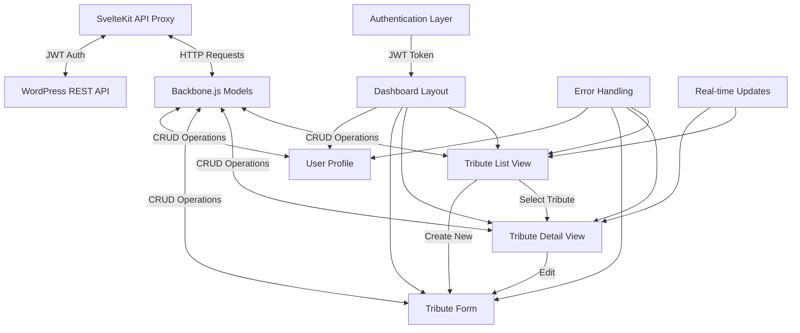
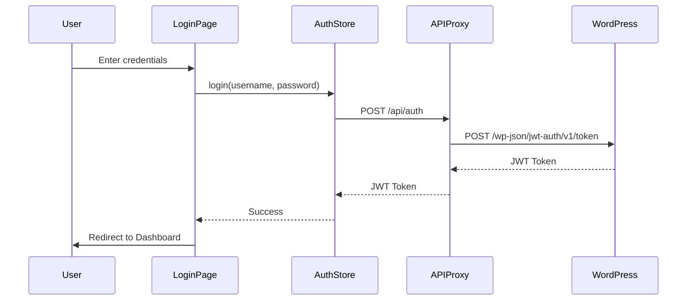
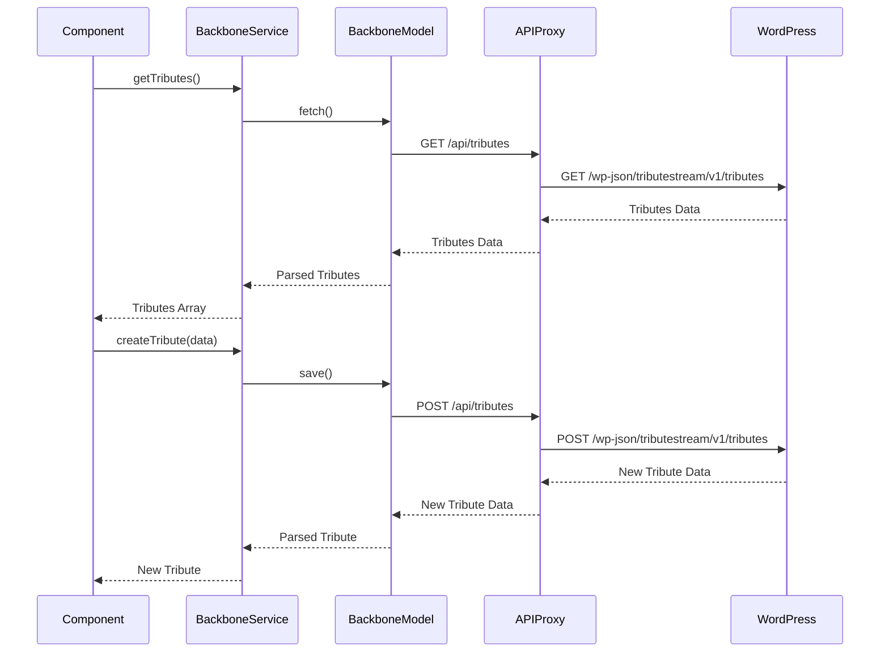
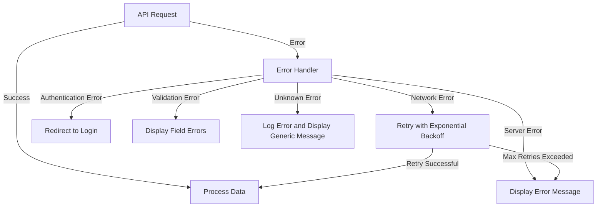
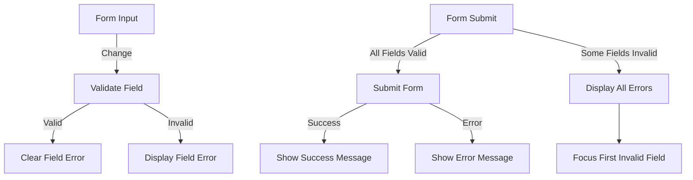

# Tribute Management Dashboard Implementation Plan

## Overview

This plan outlines the development of a comprehensive Tribute Management Dashboard to test the Backbone.js integration with SvelteKit for WordPress REST API interaction. The dashboard will provide a complete interface for managing tributes, including authentication, listing, viewing, creating, updating, and deleting tributes.



## Components Structure

```mermaid
graph TD
    A[src/routes/dashboard/+layout.svelte] --> B[src/routes/dashboard/+page.svelte]
    A --> C[src/routes/dashboard/tributes/+page.svelte]
    A --> D[src/routes/dashboard/tributes/[id]/+page.svelte]
    A --> E[src/routes/dashboard/tributes/new/+page.svelte]
    A --> F[src/routes/dashboard/profile/+page.svelte]
    
    G[src/lib/components/dashboard/] --> G1[sidebar.svelte]
    G --> G2[header.svelte]
    G --> G3[footer.svelte]
    
    H[src/lib/components/tributes/] --> H1[tribute-list.svelte]
    H --> H2[tribute-card.svelte]
    H --> H3[tribute-detail.svelte]
    H --> H4[tribute-form.svelte]
    H --> H5[tribute-search.svelte]
    H --> H6[tribute-filter.svelte]
    
    I[src/lib/components/ui/] --> I1[button.svelte]
    I --> I2[input.svelte]
    I --> I3[modal.svelte]
    I --> I4[toast.svelte]
    I --> I5[pagination.svelte]
    I --> I6[loading-spinner.svelte]
    
    J[src/lib/stores/] --> J1[toast-store.ts]
    J --> J2[loading-store.ts]
    J --> J3[filter-store.ts]
```

## Implementation Plan

### 1. Dashboard Layout and Navigation

#### Dashboard Layout Component

Create a layout component for the dashboard that includes:
- Header with user info and logout button
- Sidebar navigation
- Main content area
- Footer

```svelte
<!-- src/routes/dashboard/+layout.svelte -->
<script lang="ts">
  import { onMount } from 'svelte';
  import { goto } from '$app/navigation';
  import { page } from '$app/stores';
  import { authStore } from '$lib/services/auth-service';
  import { initializeBackbone } from '$lib/services/wp-backbone-service';
  import Header from '$lib/components/dashboard/header.svelte';
  import Sidebar from '$lib/components/dashboard/sidebar.svelte';
  import Footer from '$lib/components/dashboard/footer.svelte';

  // Initialize Backbone.js
  onMount(() => {
    initializeBackbone();
    
    // Check if user is authenticated
    if (!$authStore.isAuthenticated) {
      authStore.checkAuth();
      
      // If still not authenticated, redirect to login
      if (!$authStore.isAuthenticated) {
        goto('/login');
      }
    }
  });
</script>

<div class="dashboard-layout">
  <Header />
  <div class="dashboard-content">
    <Sidebar />
    <main>
      <slot />
    </main>
  </div>
  <Footer />
</div>
```

#### Dashboard Navigation Components

Create components for the dashboard navigation:
- Header with user info and logout button
- Sidebar with navigation links
- Footer with copyright info

### 2. Authentication and User Management

#### Enhanced Login Page

Enhance the existing login page with:
- Form validation
- Error handling
- Remember me functionality
- Password reset link
- Registration link

#### User Profile Page

Create a user profile page that allows users to:
- View their profile information
- Update their profile information
- Change their password
- View their tributes

### 3. Tribute List View

Enhance the existing tribute list component with:
- Sorting by different fields
- Filtering by status, date, etc.
- Pagination
- Search functionality
- Bulk actions (delete, change status)
- Responsive design for mobile and desktop

### 4. Tribute Detail View

Create a tribute detail view that shows:
- All tribute information
- Related media
- Edit and delete buttons
- Back to list button
- Share functionality

### 5. Tribute Form

Create a tribute form component for creating and editing tributes:
- Form validation
- Error handling
- File uploads for media
- Preview functionality
- Save as draft functionality
- Submit for review functionality

### 6. Real-time Updates

Implement real-time updates using:
- Polling for changes
- WebSockets for real-time notifications
- Optimistic UI updates

### 7. Error Handling and Notifications

Create a robust error handling system:
- Toast notifications for success/error messages
- Error boundaries for component errors
- Fallback UI for failed data fetching
- Retry mechanisms for failed requests

### 8. Performance Optimization

Implement performance optimizations:
- Lazy loading of components
- Code splitting
- Memoization of expensive computations
- Virtualized lists for large datasets
- Debounced search and filter inputs

## Technical Implementation Details

### 1. Authentication Flow



### 2. Data Flow for CRUD Operations



### 3. Error Handling Strategy



### 4. Form Validation Strategy



## Testing Strategy

### 1. Unit Tests

- Test Backbone.js models and collections
- Test authentication service
- Test form validation
- Test error handling

### 2. Integration Tests

- Test API integration
- Test authentication flow
- Test CRUD operations
- Test real-time updates

### 3. End-to-End Tests

- Test complete user flows
- Test responsive design
- Test performance
- Test error scenarios

## Implementation Timeline

1. **Week 1**: Set up dashboard layout and navigation
2. **Week 2**: Implement authentication and user management
3. **Week 3**: Enhance tribute list view and implement tribute detail view
4. **Week 4**: Implement tribute form and real-time updates
5. **Week 5**: Implement error handling, notifications, and performance optimizations
6. **Week 6**: Testing and bug fixes

## Backbone.js Integration Testing

The Tribute Management Dashboard will thoroughly test all aspects of the Backbone.js integration:

1. **Model and Collection Operations**
   - Creating, reading, updating, and deleting tributes
   - Fetching collections with filtering, sorting, and pagination
   - Handling model validation and errors

2. **Authentication**
   - JWT token management
   - Authentication state persistence
   - Token refresh and expiration handling

3. **Synchronization**
   - Custom sync methods for API integration
   - Handling offline/online states
   - Conflict resolution

4. **Events and Reactivity**
   - Model change events
   - Collection add/remove events
   - Integration with Svelte's reactivity system

5. **Error Handling**
   - Network errors
   - Validation errors
   - Server errors

This comprehensive testing will ensure that the Backbone.js integration works correctly and efficiently with SvelteKit and the WordPress REST API.